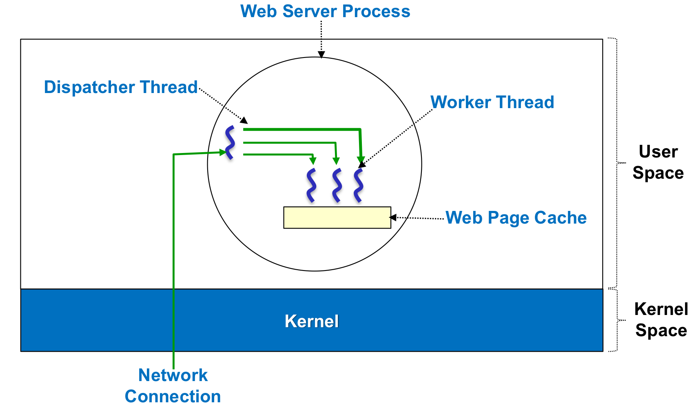
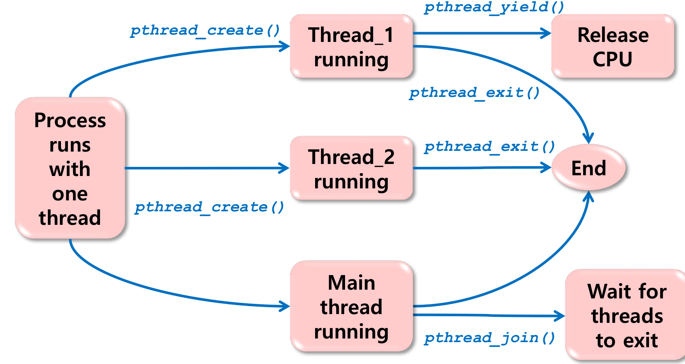

# CH4. Processes

## 4.1. Process Concepts
### 4.1.1. What is a process?
__Important Concepts__ 
- "Decomposition" -> Solve a hard problem by breaking it into smaller, easier problems that can be solved separately.
> 1) Program : A set of instructions that specify the computation to be performed. (정적인 Binary file)
> 2) Process : Program in execution. An execution stream in the context of a particular process state. (동적인 실행 중인 프로그램)    
> 3) Process State : Everything that can affect, or be affected by the process. ex) Code, Data values, Open files, etc.
> 4) Execution Stream : A sequence of instructions executed in a process state. ex) Key simplifying feature of a process.

__Process State(or context)__ 
- PCB(Process Control Block)로 관리함.
> 1) Memory context : Code, Data, Stack, Heap
> 2) Hardware context : Program Counter, Stack Pointer, I/O Registers, etc.
> 3) System context : Open files, Process table, Page table, etc.

__Multiprogramming vs multiprocessing__
>> Memory 관점
> 1) Uniprogramming : One process in memory at a time.
> 2) Multiprogramming : Multiple processes in memory at a time.

>> CPU 관점
> 1) Singletasking : One process are running at a time.
> 2) Multitasking : Multiple processes are running together at a time.

- Uniprogramming & Singletasking : Possible
- Multiprogramming & Multitasking : Possible
- Uniprogramming & Singletasking : Impossible (by definition of Multiprogramming)
- Multiprogramming & Multitasking : Possible but not common (swapping 을 통해 가능함)

__Design time entity vs Run time entity__
> 1) Design time entity : Task(or program) > Decomposition을 통해 일을 처리 하기 위해서 OS가 등장함.
> 2) Run time entity : Process > Process를 통해 Decomposition을 구현함. 효율적인 Resource 사용을 위해 OS가 관리함.

### 4.1.2. Process Control Block
__Process Control Block__ 
- Process state를 저장하는 data structure.
> 1) Execution state : Program counter, Stack pointer, Registers, etc.
> 2) Scheduling information : Priority, Scheduling queue pointers, etc.
> 3) Accounting and other misc. information : Open files
> System-wide table of PCB
- Process table > Heap에 저장됨. (size 변동 가능)

### 4.1.3. State transition diagram

Ready queue (Run queue) : CPU를 사용할 준비가 돼있는 Process들의 Queue
Waiting queue : I/O를 기다리는 Process들의 Queue > Multiple waiting queue가 존재함.
Running process : CPU를 사용 중인 Process

> 1) Ready > Running : Dispatch
> 2) Running > Ready : Interrupted (Preemptive, Hardware Interrupt, Asynchronous Blocking)
> 3) Running > Waiting : Waiting for I/O or Event (Non-preemptive, Software Interrupt, Synchronous Blocking By system call)
> 4) Wating > Ready : I/O completion or Event Occurrence

## 4.2. Process Scheduling
### 4.2.1. Process Scheduling Goals
__Process Scheduling Goals__ 
- 여러 Process들이 CPU를 공유하면서 효율적으로 사용할 수 있도록 하는 것.

__Constraints__
> 1) Fair Scheduling : 모든 Process가 CPU를 공평하게 사용할 수 있도록.
> 2) Protection : Process간의 간섭을 막아야 함.

__Separation of Policy and Mechanism__
> 1) Policy : What to do > Scheduling algorithm
> 2) Mechanism : How to do > Dispatcher, Context switching

### 4.2.2. Dispatcher
__Dispatcher__ 
- Process를 CPU에 할당하는 OS의 component > Kernel function

> loop forever {
>    run the process for a while
>    stop it and save its state
>    load state of another process
>}

__Non-preemptive Dispatcher__ 
- Process가 Dispatcher를 깨울 것을 믿고 기다림.

__Preemptive Dispatcher__
- Timer interrupt를 통해 Process를 깨움.

### 4.2.3. Kernel
__Kernel__ 
- OS의 핵심 부분. Process Scheduling, Memory Management, File System, etc.
> - PSW(Program Status Word)에 Mode bit 가 있음.

__Miss Conception__ 
- Process처럼 Kernel은 Active하고 Independent한 entity로 Thread control을 가짐. User process를 monitoring 하고 있음.
__In Reality__ 
- Kernel은 Kernel 함수와 ISR(Interrupt Service Routine)로 이루어진 Passive하고 Dependent한 entity로 User process에 의해 호출됨.

__Kernel Space__ 
- Kernel이 실행되는 공간. system call을 통해 호출된 함수들의 공간.
- Protected memory space
- Full access to hardware
- Elevated system state + Unrestricred memory access

__User Space__ 
- User process가 실행되는 공간. Kernel Space에 비해 제한된 System state 이다.
- A subset of the machine's available resources
- Limited priivileges > unable to perform certain functions
- Restricted system state + Restricted memory access

__Entering the Kernel__
- Traps : events internal to user process. ex) system call, Errors(illegal instruction, address error, etc), Page faults, etc.
- Interrupts : events external to user process. ex) Timer interrupt, Completion of a disk transfer, Character typed at a terminal, etc.

__System Call vs. Function call__ 
- Common properties : Transfer control to another routine. Maintain the context of the process.
- Differences : System call incurs a mode switch. System call is slower(expensive) than function call.

## 4.3. Context Switching
### 4.3.1. Context
__User Context__
- User process가 실행되는 동안의 상태. User stack을 사용할 것.
__Kernel Context__
- Kernel이 실행되는 동안의 상태. Kernel stack을 사용할 것.
__Interrupt Context__
- Interrupt service routine이 실행되는 동안의 상태. > ISR은 Context Switching의 대상이 아니므로 Blocking system call을 호출할 수 없다.

### 4.3.2. Context Switching Mechanism
__Mechanism__
- "Context Switching"
> Memory Context
> > Data, Segment, Stack, etc.
> > Multiprogramming 상황이므로 굳이 Disk로 대피시킬 필요가 없다.
> HW Context
> > 1) PC(Prohram Counter) : 다음에 실행할 명령어의 주소
> > 2) SP(Stack Pointer) : Stack의 위치
> > 3) PSW(Program Status Word) : Mode bit, Interrupt enable bit, etc.
> > 4) General Registers, Floating Point Registers, etc.
> > HW Context의 Register 들을 Stack으로 대피시켜야 한다.

### 4.3.3. Context Switching Implementation
__Context Switching Implementation__
- Interrupt를 통해서 구현함.
> Interrupt가 일어나면 HW 적으로 Micro controller가 다음과 같은 일을 수행한다.
> 1) PSW(Program Status Word)를 저장
> 2) Return Address를 저장
> 3) General Registers, Floating Point Registers, etc.를 저장
> 4) Stack Pointer를 저장
> 5) Interrupt vector table을 참조하여 해당하는 ISR을 실행
> 6) OS의 Scheduler 함수를 호출 > 다음에 실행할 Process를 선택
> 7) iRET(Interrupt Return) 명령어를 통해 Context Switching을 수행

## 4.4. Process Creation and Termination
### 4.4.1. Process Creation
__From Scratch__
- 1) Load code and data into memory
- 2) Create (empty) call stack
- 3) Create and initialize PCB
- 4) Put the process on ready queue

__Cloning__
- 1) Stop the current process and save its state
- 2) Create a new one by making a copy of code, data, stack, and PCB (except for PID)
- 3) Put the new process on the ready queue

__Fork() System Call__
- Parent process creates a child process
- Child process is a clone of the parent process
- Child process has a different PID

__exec() System Call__
- Replace the current process with a new one
- Load a new program into the current process
- The new program starts from the beginning

__exit() System Call__
- Terminate the current process
- Release all resources
- Notify the parent process
- Return the exit status

__wait() System Call__
- Parent process waits for the child process to terminate
- Parent process can get the exit status of the child process
- Parent process can get the termination reason of the child process

__Shell example__
for(;;){
    cmd = readcmd();
    pid = fork();
    if(pid <0){
        perror("fork failed");
        exit(-1);
    }
    else if (pid == 0){
        // Child process - Setup environment and execute the command
        if(exec(cmd) < 0) {
            perror("exec failed");
            exit(-1);
        }
    }
    else{
        //Parent process - wait for the child process to terminate
        wait(pid);
    }
}

### 4.4.2. Process Termination
__Process Termination__
- Normal termination
> Child process executes the exit() system call
> - Outputs data from child to parent(via wait())
> - Deallocates process resources

- Abnormal termination
> Parent executes the abort() system call
> - Chiled has exceeded allocated resources
> - Task assigned to child is no longer required
> - Parent is exiting and child must be terminated

__Drawbacks of the original fork()__
- Deep copy-based cloning was simply too expensive

__Why did early Unnix adopt fork()?__
- Due to the lack of inter-process communication mechanisms

__Why is it still used in Linux?__
- Thanks to shallow copy and copy-on-write mechanism

## 4.5. Multithreading Models
### 4.5.1. Process Model
__Traditional Process Model__
- Unit of resource allocation : process(or task)
- Unit of dispatching : process(or task)

__Multithreaded Process Model__
- Unit of resource allocation : process(or task)
- Unit of dispatching : thread(or lightweight process)

### 4.5.2. Multithreading: Basics
__Characteristics of Threads__
> - Has an execution state(Ready, Running, Waiting) > saves thread context
> - Has a runtime stack for local variables and some per-thread static memory
> - Has access to the memory address space and resources of its process
> > - All threads of a process share these
> > - When one thread alters a resource, all threads of the process can see the change
> > - A file opened by a thread is abailable to other threads of the process

__State Transition of Threads__
> Running, ready, blocked, terminated
> Have no suspended(i.e. swapped-out) state
> > All thread of the same process share the same address space
> > Suspending a single thread involves suspending all threads in the same address space
> Termination of a process terminates all threads within the process

__Benefits of Multithreading__
> 1) Effective concurrent programming
> 2) Resource sharing
> > Can pass data via shared memory (No need for IPC, Need to synchronize the activities of threads)
> 3) Economy(Cheap to implement)
> > Takes less time to create, terminate and switch threads than processes. Use little resources(only stack and per-thread static memory)
> 4) Responsiveness
> > Concurrent server architecture for interactive applications

__Concurrent Server Architecture__
> > 
> > __Dispatcher Thread__
> > while(True){
> >     get_next_request(&buf);
> >     dispatch_work(&buf); 
> >}
>
> > __Worker Thread__
> > while(True){
> >     wait_for_work(&buf)
> >     look_for_page_in_cache(&buf, &page);
> >     if(page_not_in_cache(&page))
> >         read_page_from_disk(&buf, &page);
> >     return_page(&page);
> >}

### 4.5.3. Pthread Programming Model
__Pthread__
- POSIX standard for threads

__Selected Pthread Functions__
> __Pthread API__
> pthread_create()  : Create a new thread
> pthread_exit()    : Terminate the calling thread
> pthread_join()    : Wait for a specific thread to terminate
> pthread_yield()   : Release the CPU
>

>   /* Example of a simple Pthread program */
>   #include <stdio.h>
>   #include <pthread.h>
>   #include <stdlib.h>
>   #include <assert.h>
>   #define NUM_THREADS 5
>   void *ThreadCode(void *argument)
>   {
>       int tid;
>       tid = *((int *)argument);
>       printf("Hello World! It's me, thread %d!\n", tid);
>   
>       /* optionally: insert more useful stuff here */
>   
>       return NULL;
>   }

>   /* main program */
>   int main(void)
>   {
>       pthread_t threads[NUM_THREADS];
>       int thread_args[NUM_THREADS];
>       int rc, i;
>   
>       /* create all threads */
>       for (i=0; i<NUM_THREADS; ++i) {
>           thread_args[i] = i;
>           printf("In main: creating thread %d\n", i);
>           rc = pthread_create(&threads[i], NULL, ThreadCode, (void *)&thread_args[i]);
>           assert(0 == rc);
>       }
>       
>       /* wait for all threads to complete */
>       for (i=0; i<NUM_THREADS; ++i) {
>           rc = pthread_join(threads[i], NULL);
>           assert(0 == rc);
>       }
>       exit(EXIT_SUCCESS);
>   }

### 4.5.4. User-Level Threads
__Characteristics__
- Processor
> - Allocation on a process basis

- Thread :
> - Managed by the application(100% user-level entity)
> - Kernel is not aware of the existence of threads

- Thread library :
> - User-level library linked to process code
> - Contains code 
> > - 1) Creating, destroying thread. 
> > - 2) Scheduling threads execution. 
> > - 3) Saving and restoring thread context.
> > - 4) Passing messages between threads.

- Kernel :
> - When a thread makes a blocking system call
> > The entire process is blocked.
> > For the thread library, that thread is still in the running state.
> > __Implication__ : Thread states are independent of process states.

__Advantages__
- Thread switching does not involve kernel mode switching - no mode switching overhead
- Scheduling can be application specific
- This can run on any OS (only uses a thread library)

__Inconveniences__
- Most system calls are blockingm so the entire process is blocked
- Kernel can only assign processes to processors. So, two threads within the same process cannot run on different processors
  
### 4.5.5. Kernel-Level Threads
__Characteristics__
- Processor
> - Allocation on a thread basis

- Thread :
> - Managed by the kernel
> - 1-to-1 mapping between user-level threads and kernel-level threads
> - Kernel is aware of the existence of threads
> 
- Systemc call  API and kernel functions for thread facilities : 
> - Code for
> > - 1) Maintaining context information for processes and threads
> > - 2) Switching between threads
> > - 3) Schedule threads
> > - 4) Synchronization

- Kernel :
> - No thread library but API to the kernel thread facility
> - Scheduling on a thread basis

__Advantages__
- Kernel can schedule many threads of the same process on different processors
- Blocking is done on a thread level
- Kernel routines can be multithreaded

__Inconveniences__
- Thread switching within the same process involves the kernel: we have two mode switching overhead per thread switch
- This results in a significant performance loss

### 4.5.6. Combined User-Level and Kernel-Level Threads
__Characteristics__
- Processor
> - Allocation on a thread basis

- System call API and kernel functions for thread facilities
> - Code for
> > - 1) Creating, destroying kernel-level threads
> > - 2) Mapping, unmapping between user-level threads and kernel-level threads
> > - 3) Maintaining context information for processes and threads
> > - 4) Switching between threads
> > - 5) Scheduling threads

- User-level :
> Thread creation done in user space
> User-level scheduling for sharing kernel-level threads
> Synchronization of threads done in user space

- Kernel-level :
> Kernel-level scheduling on a thread basis

__Advantages__
- Programmer may adjust the number of kernel-level threads
- May combine the best of both approaches