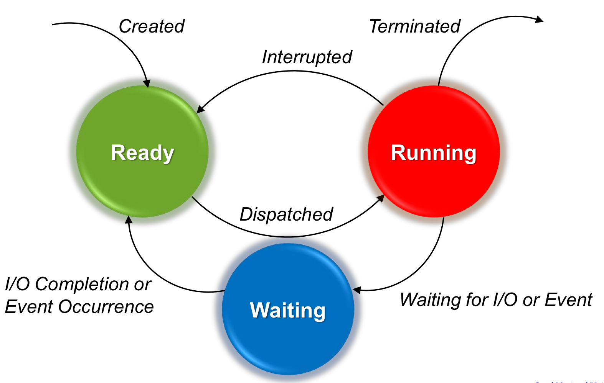

# CH4. Processes

## 4.1. Process Concepts
### 4.1.1. What is a process?
__Important Concepts__ : "Decomposition"
-> Solve a hard problem by breaking it into smaller, easier problems that can be solved separately.
1) Design time view : Decomposition을 통해 일을 처리 하기 위해서 OS가 등장함.
2) Run time view : Process를 통해 Decomposition을 구현함. 효율적인 Resource 사용을 위해 OS가 관리함.
3) Process : Program을 실행하는 instance. An execution stream in the context of a particular process state.
4) Process State : Everything that can affect, or be affected by the process.
   - Code, Data values, Open files, etc.
5) Execution Stream : A sequence of instructions executed in a process state.
   - Key simplifying feature of a process.

__Process State(or context)__ : PCB(Process Control Block)로 관리함.
1) Memory context : Code, Data, Stack, Heap
2) Hardware context : Program Counter, Stack Pointer, I/O Registers, etc.
3) System context : Open files, Process table, Page table, etc.

__Multiprogramming vs multiprocessing__
1) Uniprogramming : One process in memory at a time.
2) Multiprogramming : Multiple processes in memory at a time.
3) Single tasking : One process are running at a time.
4) Multitasking : Multiple processes are running together at a time.

1 & 3 : Possible
2 & 4 : Possible
1 & 4 : Possible but not common (swapping 을 통해 가능함)
2 & 3 : Impossible

__Design time entity vs Run time entity__
1) Design time entity : Task(or program)
2) Run time entity : Process

### 4.1.2. Process Control Block
__Process Control Block__ : Process state를 저장하는 data structure.
1) Execution state : Program counter, Stack pointer, Registers, etc.
2) Scheduling information : Priority, Scheduling queue pointers, etc.
3) Accounting and other misc. information : Open files
> System-wide table of PCB : Process table

### 4.1.3. State transition diagram

1) Ready > Running : Dispatch
2) Running > Ready : Interrupted (Preemptive, Hardware Interrupt, Asynchronous Blocking)
3) Running > Waiting : Waiting for I/O or Event (Non-preemptive, Software Interrupt, Synchronous Blocking, By system call)
4) Wating > Ready : I/O completion or Event Occurrence

## 4.2. Process Scheduling

## 4.3. Context Switching

## 4.4. Process Creation and Termination

## 4.5. Multithreading Models
