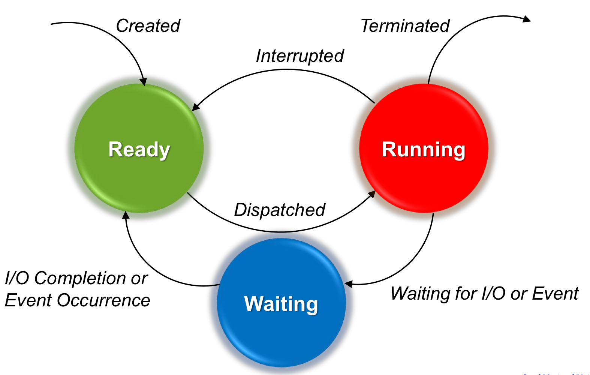
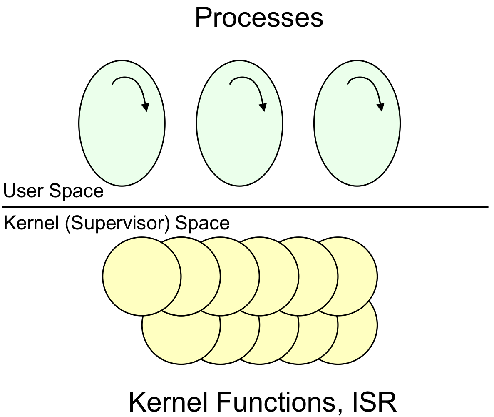

# CH4. Processes

## 4.1. Process Concepts
### 4.1.1. What is a process?
> __Important Concepts__ 
- "Decomposition" -> Solve a hard problem by breaking it into smaller, easier problems that can be solved separately.
1) Program : A set of instructions that specify the computation to be performed. (정적인 Binary file)
2) Process : Program in execution. An execution stream in the context of a particular process state. (동적인 실행 중인 프로그램)    
3) Process State : Everything that can affect, or be affected by the process. ex) Code, Data values, Open files, etc.
4) Execution Stream : A sequence of instructions executed in a process state. ex) Key simplifying feature of a process.

> __Process State(or context)__ 
> - PCB(Process Control Block)로 관리함.
1) Memory context : Code, Data, Stack, Heap
2) Hardware context : Program Counter, Stack Pointer, I/O Registers, etc.
3) System context : Open files, Process table, Page table, etc.

> __Multiprogramming vs multiprocessing__
>> Memory 관점
1) Uniprogramming : One process in memory at a time.
2) Multiprogramming : Multiple processes in memory at a time.

>> CPU 관점
1) Singletasking : One process are running at a time.
2) Multitasking : Multiple processes are running together at a time.

- Uniprogramming & Singletasking : Possible
- Multiprogramming & Multitasking : Possible
- Uniprogramming & Singletasking : Impossible (by definition of Multiprogramming)
- Multiprogramming & Multitasking : Possible but not common (swapping 을 통해 가능함)

> __Design time entity vs Run time entity__
1) Design time entity : Task(or program) > Decomposition을 통해 일을 처리 하기 위해서 OS가 등장함.
2) Run time entity : Process > Process를 통해 Decomposition을 구현함. 효율적인 Resource 사용을 위해 OS가 관리함.

### 4.1.2. Process Control Block
> __Process Control Block__ 
> - Process state를 저장하는 data structure.
1) Execution state : Program counter, Stack pointer, Registers, etc.
2) Scheduling information : Priority, Scheduling queue pointers, etc.
3) Accounting and other misc. information : Open files
> System-wide table of PCB
> - Process table > Heap에 저장됨. (size 변동 가능)

### 4.1.3. State transition diagram

Ready queue (Run queue) : CPU를 사용할 준비가 돼있는 Process들의 Queue
Waiting queue : I/O를 기다리는 Process들의 Queue > Multiple waiting queue가 존재함.
Running process : CPU를 사용 중인 Process

1) Ready > Running : Dispatch
2) Running > Ready : Interrupted (Preemptive, Hardware Interrupt, Asynchronous Blocking)
3) Running > Waiting : Waiting for I/O or Event (Non-preemptive, Software Interrupt, Synchronous Blocking By system call)
4) Wating > Ready : I/O completion or Event Occurrence

## 4.2. Process Scheduling
### 4.2.1. Process Scheduling Goals
> __Process Scheduling Goals__ 
> - 여러 Process들이 CPU를 공유하면서 효율적으로 사용할 수 있도록 하는 것.

__Constraints__
1) Fair Scheduling : 모든 Process가 CPU를 공평하게 사용할 수 있도록.
2) Protection : Process간의 간섭을 막아야 함.

__Separation of Policy and Mechanism__
1) Policy : What to do > Scheduling algorithm
2) Mechanism : How to do > Dispatcher, Context switching

### 4.2.2. Dispatcher
> __Dispatcher__ 
> - Process를 CPU에 할당하는 OS의 component > Kernel function

> loop forever {
>    run the process for a while
>    stop it and save its state
>    load state of another process
>}

> __Non-preemptive Dispatcher__ 
> - Process가 Dispatcher를 깨울 것을 믿고 기다림.

> __Preemptive Dispatcher__
> - Timer interrupt를 통해 Process를 깨움.

### 4.2.3. Kernel
> __Kernel__ 
> - OS의 핵심 부분. Process Scheduling, Memory Management, File System, etc.
>- PSW(Program Status Word)에 Mode bit 가 있음.

> __Miss Conception__ 
> - Process처럼 Kernel은 Active하고 Independent한 entity로 Thread control을 가짐. User process를 monitoring 하고 있음.
> __In Reality__ 
> - Kernel은 Kernel 함수와 ISR(Interrupt Service Routine)로 이루어진 Passive하고 Dependent한 entity로 User process에 의해 호출됨.

> __Kernel Space__ 
> - Kernel이 실행되는 공간. system call을 통해 호출된 함수들의 공간.
- Protected memory space
- Full access to hardware
- Elevated system state + Unrestricred memory access

> __User Space__ 
> - User process가 실행되는 공간. Kernel Space에 비해 제한된 System state 이다.
- A subset of the machine's available resources
- Limited priivileges > unable to perform certain functions
- Restricted system state + Restricted memory access

> __Entering the Kernel__
- Traps : events internal to user process. ex) system call, Errors(illegal instruction, address error, etc), Page faults, etc.
- Interrupts : events external to user process. ex) Timer interrupt, Completion of a disk transfer, Character typed at a terminal, etc.

> __System Call vs. Function call__ 
- Common properties : Transfer control to another routine. Maintain the context of the process.
- Differences : System call incurs a mode switch. System call is slower(expensive) than function call.

## 4.3. Context Switching

## 4.4. Process Creation and Termination

## 4.5. Multithreading Models
